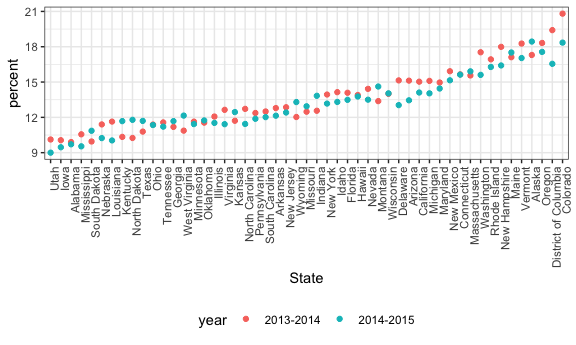

strings\_and\_factors
================
Xue Yang
10/11/2018

Load some packages.

``` r
library(rvest)
```

    ## Loading required package: xml2

    ## 
    ## Attaching package: 'rvest'

    ## The following object is masked from 'package:purrr':
    ## 
    ##     pluck

    ## The following object is masked from 'package:readr':
    ## 
    ##     guess_encoding

``` r
library(p8105.datasets)
```

### Regex

``` r
# create a collection of string vector
string_vec = c("my", "name", "is", "jeff")

# scan through the string and look for something that match
str_detect(string_vec, "jeff")
```

    ## [1] FALSE FALSE FALSE  TRUE

``` r
str_detect(string_vec, "Jeff")
```

    ## [1] FALSE FALSE FALSE FALSE

``` r
# scan through the string and look for the match and replace the match
str_replace(string_vec, "jeff", "Jeff")
```

    ## [1] "my"   "name" "is"   "Jeff"

``` r
str_replace(string_vec, "je", "Je") # also can be mathc and replace
```

    ## [1] "my"   "name" "is"   "Jeff"

``` r
# ?str_detect
```

``` r
string_vec = c(
  "i think we all rule for participating",
  "i think i have been caught",
  "i think this will be quite fun actually",
  "it will be fun, i think"
  )

str_detect(string_vec, "i think") # "i think whereever show up"
```

    ## [1] TRUE TRUE TRUE TRUE

``` r
str_detect(string_vec, "^i think") # "i think" should be at the beginning
```

    ## [1]  TRUE  TRUE  TRUE FALSE

``` r
str_detect(string_vec, "i think$") # "i think" should be at the end
```

    ## [1] FALSE FALSE FALSE  TRUE

``` r
string_vec = c(
  "Y'all remember Pres. HW Bush?",
  "I saw a green bush",
  "BBQ and Bushwalking at Molonglo Gorge",
  "BUSH!!"
  )

# match upper or lower case of B and then followed by lower case of ush
str_detect(string_vec,"[Bb]ush") 
```

    ## [1]  TRUE  TRUE  TRUE FALSE

``` r
string_vec = c(
  '7th inning stretch',
  '1st half soon to begin. Texas won the toss.',
  'she is 5 feet 4 inches tall',
  '3AM - cant sleep :('
  )

# start with a number and followed by a letter (both upper and lower)
str_detect(string_vec, "^[0-9][a-zA-Z]") 
```

    ## [1]  TRUE  TRUE FALSE  TRUE

``` r
string_vec = c(
  'Its 7:11 in the evening',
  'want to go to 7-11?',
  'my flight is AA711',
  'NetBios: scanning ip 203.167.114.66'
  )

# 7 and followed by anything and then 11 (The character . matches anything.)
str_detect(string_vec, "7.11") 
```

    ## [1]  TRUE  TRUE FALSE  TRUE

``` r
string_vec = c(
  'The CI is [2, 5]',
  ':-]',
  ':-[',
  'I found the answer on pages [6-7]'
  )

# find match for "[" using "\\" (special characters)
str_detect(string_vec, "\\[") 
```

    ## [1]  TRUE FALSE  TRUE  TRUE

### PULSE data

Tidy the PULSE data!!

``` r
pulse_data = haven::read_sas("./data/public_pulse_data.sas7bdat") %>%
  janitor::clean_names() %>%
  gather(key = visit, value = bdi, bdi_score_bl:bdi_score_12m) %>%
  mutate(
    # look through visit variable and replace the "bdi_score_" with nothing
    visit = str_replace(visit, "bdi_score_", ""),
    # scan through the new version of visit variable and replace "bl" with "00m"
         visit = str_replace(visit, "bl", "00m"),
    # treat the strings as a factor and relevel it as "00m", "01m", "06m", "12m"
         visit = fct_relevel(visit, str_c(c("00", "01", "06", "12"), "m"))) %>% 
  # might nothing change, but when use str()
 # $ visit: Factor w/ 4 levels "00m","01m","06m",..: 1 1 1 1 1 1 1 1 1 1 ...
  arrange(id, visit)
```

    ## Warning: attributes are not identical across measure variables;
    ## they will be dropped

### NSDUH

``` r
url = "http://samhda.s3-us-gov-west-1.amazonaws.com/s3fs-public/field-uploads/2k15StateFiles/NSDUHsaeShortTermCHG2015.htm"
drug_use_xml = read_html(url)

table_marj = (drug_use_xml %>% html_nodes(css = "table")) %>% 
  .[[1]] %>%
  html_table() %>%
  slice(-1) %>%
  as_tibble() 
```

clean up the imported data...

``` r
data_marj = 
  table_marj %>%
  
  # remove any columns contain "P Value"
  select(-contains("P Value")) %>% 
  
  # make the all variables the other than "State" to be as the value of key
  gather(key = key, value = percent, -State) %>% 
  
  # separate age and year by "("
  separate(key, into = c("age", "year"), sep = "\\(") %>% 
  
  mutate(
    # replace ")" in year with nothing
    year = str_replace(year, "\\)", ""), 
    # replace "a" to "c" in percent which at end with nothing
    percent = str_replace(percent, "[a-c]$", ""), 
    percent = as.numeric(percent)) %>%
  filter(!(State %in% c("Total U.S.", "Northeast", "Midwest", "South", "West")))
```

Now that we have tidy data, we can make some plot!

``` r
data_marj %>%
  filter(age == "12-17") %>% 
  ggplot(aes(x = State, y = percent, color = year)) + 
    geom_point() + 
    theme(axis.text.x = element_text(angle = 90, hjust = 1))
```


``` r
data_marj %>%
  filter(age == "12-17") %>% 
  # reorder the state variable according to the median of percent variable
  mutate(State = fct_reorder(State, percent)) %>% 
  ggplot(aes(x = State, y = percent, color = year)) + 
    geom_point() + 
    theme(axis.text.x = element_text(angle = 90, hjust = 1)) # shift the text in axis-x 
```



``` r
url_base = "https://www.amazon.com/product-reviews/B00005JNBQ/ref=cm_cr_arp_d_viewopt_rvwer?ie=UTF8&reviewerType=avp_only_reviews&sortBy=recent&pageNumber="

urls = str_c(url_base, 1:5) # get review from page 1 to 5

read_html(urls[1]) %>% 
  html_nodes("#cm_cr-review_list .review-title") %>%
  html_text()
```

    ##  [1] "Go watch THE ROCK or dumb & dumber instead"
    ##  [2] "My mom loves it"                           
    ##  [3] "Nothing Quite Like It."                    
    ##  [4] "Has pretty sweet bow skills."              
    ##  [5] "Great"                                     
    ##  [6] "Fast delivery"                             
    ##  [7] "Lol"                                       
    ##  [8] "Vote For Pedro"                            
    ##  [9] "So funny!"                                 
    ## [10] "Great move"

``` r
##  [1] "Go watch THE ROCK or dumb & dumber instead"
##  [2] "My mom loves it"                           
##  [3] "Nothing Quite Like It."                    
##  [4] "Has pretty sweet bow skills."              
##  [5] "Great"                                     
##  [6] "Fast delivery"                             
##  [7] "Lol"                                       
##  [8] "Very funny movie"                          
##  [9] "Vote For Pedro"                            
## [10] "So funny!"

read_html(urls[2]) %>% 
  html_nodes("#cm_cr-review_list .review-title") %>%
  html_text()
```

    ##  [1] "Refund needed. Did not pay through Amazon prime."
    ##  [2] "Need a laugh?"                                   
    ##  [3] "The greatest!"                                   
    ##  [4] "Five Stars"                                      
    ##  [5] "Napoleon Dynamite is an awesome movie"           
    ##  [6] "One Star"                                        
    ##  [7] "<U+0001F62B>"                                    
    ##  [8] "Five Stars"                                      
    ##  [9] "Haha"                                            
    ## [10] "Five Stars"

``` r
##  [1] "Great move"                                      
##  [2] "Refund needed. Did not pay through Amazon prime."
##  [3] "Need a laugh?"                                   
##  [4] "The greatest!"                                   
##  [5] "Five Stars"                                      
##  [6] "Napoleon Dynamite is an awesome movie"           
##  [7] "One Star"                                        
##  [8] "\U0001f62b"                                      
##  [9] "Five Stars"                                      
## [10] "Haha"
```

### Factors...

``` r
vec_sex = factor(c("male", "male", "female", "female")) 
# Since we don't specify which is the first category so R choose the level for what is the category 1 and what is category 2
as.numeric(vec_sex)
```

    ## [1] 2 2 1 1

``` r
# recreate the reference of level to be "male"
vec_sex = relevel(vec_sex, ref = "male") 
vec_sex
```

    ## [1] male   male   female female
    ## Levels: male female

``` r
as.numeric(vec_sex)
```

    ## [1] 1 1 2 2

### Weather data

Here's the weather data again.

``` r
weather_df = 
  rnoaa::meteo_pull_monitors(c("USW00094728", "USC00519397", "USS0023B17S"),
                      var = c("PRCP", "TMIN", "TMAX"), 
                      date_min = "2017-01-01",
                      date_max = "2017-12-31") %>%
  mutate(
    name = recode(id, USW00094728 = "CentralPark_NY", 
                      USC00519397 = "Waikiki_HA",
                      USS0023B17S = "Waterhole_WA"),
    tmin = tmin / 10,
    tmax = tmax / 10) %>%
  select(name, id, everything())
weather_df
```

    ## # A tibble: 1,095 x 6
    ##    name           id          date        prcp  tmax  tmin
    ##    <chr>          <chr>       <date>     <dbl> <dbl> <dbl>
    ##  1 CentralPark_NY USW00094728 2017-01-01     0   8.9   4.4
    ##  2 CentralPark_NY USW00094728 2017-01-02    53   5     2.8
    ##  3 CentralPark_NY USW00094728 2017-01-03   147   6.1   3.9
    ##  4 CentralPark_NY USW00094728 2017-01-04     0  11.1   1.1
    ##  5 CentralPark_NY USW00094728 2017-01-05     0   1.1  -2.7
    ##  6 CentralPark_NY USW00094728 2017-01-06    13   0.6  -3.8
    ##  7 CentralPark_NY USW00094728 2017-01-07    81  -3.2  -6.6
    ##  8 CentralPark_NY USW00094728 2017-01-08     0  -3.8  -8.8
    ##  9 CentralPark_NY USW00094728 2017-01-09     0  -4.9  -9.9
    ## 10 CentralPark_NY USW00094728 2017-01-10     0   7.8  -6  
    ## # ... with 1,085 more rows

``` r
weather_df %>% 
  mutate(name = factor(name)) %>% pull(name)
```

    ##    [1] CentralPark_NY CentralPark_NY CentralPark_NY CentralPark_NY
    ##    [5] CentralPark_NY CentralPark_NY CentralPark_NY CentralPark_NY
    ##    [9] CentralPark_NY CentralPark_NY CentralPark_NY CentralPark_NY
    ##   [13] CentralPark_NY CentralPark_NY CentralPark_NY CentralPark_NY
    ##   [17] CentralPark_NY CentralPark_NY CentralPark_NY CentralPark_NY
    ##   [21] CentralPark_NY CentralPark_NY CentralPark_NY CentralPark_NY
    ##   [25] CentralPark_NY CentralPark_NY CentralPark_NY CentralPark_NY
    ##   [29] CentralPark_NY CentralPark_NY CentralPark_NY CentralPark_NY
    ##   [33] CentralPark_NY CentralPark_NY CentralPark_NY CentralPark_NY
    ##   [37] CentralPark_NY CentralPark_NY CentralPark_NY CentralPark_NY
    ##   [41] CentralPark_NY CentralPark_NY CentralPark_NY CentralPark_NY
    ##   [45] CentralPark_NY CentralPark_NY CentralPark_NY CentralPark_NY
    ##   [49] CentralPark_NY CentralPark_NY CentralPark_NY CentralPark_NY
    ##   [53] CentralPark_NY CentralPark_NY CentralPark_NY CentralPark_NY
    ##   [57] CentralPark_NY CentralPark_NY CentralPark_NY CentralPark_NY
    ##   [61] CentralPark_NY CentralPark_NY CentralPark_NY CentralPark_NY
    ##   [65] CentralPark_NY CentralPark_NY CentralPark_NY CentralPark_NY
    ##   [69] CentralPark_NY CentralPark_NY CentralPark_NY CentralPark_NY
    ##   [73] CentralPark_NY CentralPark_NY CentralPark_NY CentralPark_NY
    ##   [77] CentralPark_NY CentralPark_NY CentralPark_NY CentralPark_NY
    ##   [81] CentralPark_NY CentralPark_NY CentralPark_NY CentralPark_NY
    ##   [85] CentralPark_NY CentralPark_NY CentralPark_NY CentralPark_NY
    ##   [89] CentralPark_NY CentralPark_NY CentralPark_NY CentralPark_NY
    ##   [93] CentralPark_NY CentralPark_NY CentralPark_NY CentralPark_NY
    ##   [97] CentralPark_NY CentralPark_NY CentralPark_NY CentralPark_NY
    ##  [101] CentralPark_NY CentralPark_NY CentralPark_NY CentralPark_NY
    ##  [105] CentralPark_NY CentralPark_NY CentralPark_NY CentralPark_NY
    ##  [109] CentralPark_NY CentralPark_NY CentralPark_NY CentralPark_NY
    ##  [113] CentralPark_NY CentralPark_NY CentralPark_NY CentralPark_NY
    ##  [117] CentralPark_NY CentralPark_NY CentralPark_NY CentralPark_NY
    ##  [121] CentralPark_NY CentralPark_NY CentralPark_NY CentralPark_NY
    ##  [125] CentralPark_NY CentralPark_NY CentralPark_NY CentralPark_NY
    ##  [129] CentralPark_NY CentralPark_NY CentralPark_NY CentralPark_NY
    ##  [133] CentralPark_NY CentralPark_NY CentralPark_NY CentralPark_NY
    ##  [137] CentralPark_NY CentralPark_NY CentralPark_NY CentralPark_NY
    ##  [141] CentralPark_NY CentralPark_NY CentralPark_NY CentralPark_NY
    ##  [145] CentralPark_NY CentralPark_NY CentralPark_NY CentralPark_NY
    ##  [149] CentralPark_NY CentralPark_NY CentralPark_NY CentralPark_NY
    ##  [153] CentralPark_NY CentralPark_NY CentralPark_NY CentralPark_NY
    ##  [157] CentralPark_NY CentralPark_NY CentralPark_NY CentralPark_NY
    ##  [161] CentralPark_NY CentralPark_NY CentralPark_NY CentralPark_NY
    ##  [165] CentralPark_NY CentralPark_NY CentralPark_NY CentralPark_NY
    ##  [169] CentralPark_NY CentralPark_NY CentralPark_NY CentralPark_NY
    ##  [173] CentralPark_NY CentralPark_NY CentralPark_NY CentralPark_NY
    ##  [177] CentralPark_NY CentralPark_NY CentralPark_NY CentralPark_NY
    ##  [181] CentralPark_NY CentralPark_NY CentralPark_NY CentralPark_NY
    ##  [185] CentralPark_NY CentralPark_NY CentralPark_NY CentralPark_NY
    ##  [189] CentralPark_NY CentralPark_NY CentralPark_NY CentralPark_NY
    ##  [193] CentralPark_NY CentralPark_NY CentralPark_NY CentralPark_NY
    ##  [197] CentralPark_NY CentralPark_NY CentralPark_NY CentralPark_NY
    ##  [201] CentralPark_NY CentralPark_NY CentralPark_NY CentralPark_NY
    ##  [205] CentralPark_NY CentralPark_NY CentralPark_NY CentralPark_NY
    ##  [209] CentralPark_NY CentralPark_NY CentralPark_NY CentralPark_NY
    ##  [213] CentralPark_NY CentralPark_NY CentralPark_NY CentralPark_NY
    ##  [217] CentralPark_NY CentralPark_NY CentralPark_NY CentralPark_NY
    ##  [221] CentralPark_NY CentralPark_NY CentralPark_NY CentralPark_NY
    ##  [225] CentralPark_NY CentralPark_NY CentralPark_NY CentralPark_NY
    ##  [229] CentralPark_NY CentralPark_NY CentralPark_NY CentralPark_NY
    ##  [233] CentralPark_NY CentralPark_NY CentralPark_NY CentralPark_NY
    ##  [237] CentralPark_NY CentralPark_NY CentralPark_NY CentralPark_NY
    ##  [241] CentralPark_NY CentralPark_NY CentralPark_NY CentralPark_NY
    ##  [245] CentralPark_NY CentralPark_NY CentralPark_NY CentralPark_NY
    ##  [249] CentralPark_NY CentralPark_NY CentralPark_NY CentralPark_NY
    ##  [253] CentralPark_NY CentralPark_NY CentralPark_NY CentralPark_NY
    ##  [257] CentralPark_NY CentralPark_NY CentralPark_NY CentralPark_NY
    ##  [261] CentralPark_NY CentralPark_NY CentralPark_NY CentralPark_NY
    ##  [265] CentralPark_NY CentralPark_NY CentralPark_NY CentralPark_NY
    ##  [269] CentralPark_NY CentralPark_NY CentralPark_NY CentralPark_NY
    ##  [273] CentralPark_NY CentralPark_NY CentralPark_NY CentralPark_NY
    ##  [277] CentralPark_NY CentralPark_NY CentralPark_NY CentralPark_NY
    ##  [281] CentralPark_NY CentralPark_NY CentralPark_NY CentralPark_NY
    ##  [285] CentralPark_NY CentralPark_NY CentralPark_NY CentralPark_NY
    ##  [289] CentralPark_NY CentralPark_NY CentralPark_NY CentralPark_NY
    ##  [293] CentralPark_NY CentralPark_NY CentralPark_NY CentralPark_NY
    ##  [297] CentralPark_NY CentralPark_NY CentralPark_NY CentralPark_NY
    ##  [301] CentralPark_NY CentralPark_NY CentralPark_NY CentralPark_NY
    ##  [305] CentralPark_NY CentralPark_NY CentralPark_NY CentralPark_NY
    ##  [309] CentralPark_NY CentralPark_NY CentralPark_NY CentralPark_NY
    ##  [313] CentralPark_NY CentralPark_NY CentralPark_NY CentralPark_NY
    ##  [317] CentralPark_NY CentralPark_NY CentralPark_NY CentralPark_NY
    ##  [321] CentralPark_NY CentralPark_NY CentralPark_NY CentralPark_NY
    ##  [325] CentralPark_NY CentralPark_NY CentralPark_NY CentralPark_NY
    ##  [329] CentralPark_NY CentralPark_NY CentralPark_NY CentralPark_NY
    ##  [333] CentralPark_NY CentralPark_NY CentralPark_NY CentralPark_NY
    ##  [337] CentralPark_NY CentralPark_NY CentralPark_NY CentralPark_NY
    ##  [341] CentralPark_NY CentralPark_NY CentralPark_NY CentralPark_NY
    ##  [345] CentralPark_NY CentralPark_NY CentralPark_NY CentralPark_NY
    ##  [349] CentralPark_NY CentralPark_NY CentralPark_NY CentralPark_NY
    ##  [353] CentralPark_NY CentralPark_NY CentralPark_NY CentralPark_NY
    ##  [357] CentralPark_NY CentralPark_NY CentralPark_NY CentralPark_NY
    ##  [361] CentralPark_NY CentralPark_NY CentralPark_NY CentralPark_NY
    ##  [365] CentralPark_NY Waikiki_HA     Waikiki_HA     Waikiki_HA    
    ##  [369] Waikiki_HA     Waikiki_HA     Waikiki_HA     Waikiki_HA    
    ##  [373] Waikiki_HA     Waikiki_HA     Waikiki_HA     Waikiki_HA    
    ##  [377] Waikiki_HA     Waikiki_HA     Waikiki_HA     Waikiki_HA    
    ##  [381] Waikiki_HA     Waikiki_HA     Waikiki_HA     Waikiki_HA    
    ##  [385] Waikiki_HA     Waikiki_HA     Waikiki_HA     Waikiki_HA    
    ##  [389] Waikiki_HA     Waikiki_HA     Waikiki_HA     Waikiki_HA    
    ##  [393] Waikiki_HA     Waikiki_HA     Waikiki_HA     Waikiki_HA    
    ##  [397] Waikiki_HA     Waikiki_HA     Waikiki_HA     Waikiki_HA    
    ##  [401] Waikiki_HA     Waikiki_HA     Waikiki_HA     Waikiki_HA    
    ##  [405] Waikiki_HA     Waikiki_HA     Waikiki_HA     Waikiki_HA    
    ##  [409] Waikiki_HA     Waikiki_HA     Waikiki_HA     Waikiki_HA    
    ##  [413] Waikiki_HA     Waikiki_HA     Waikiki_HA     Waikiki_HA    
    ##  [417] Waikiki_HA     Waikiki_HA     Waikiki_HA     Waikiki_HA    
    ##  [421] Waikiki_HA     Waikiki_HA     Waikiki_HA     Waikiki_HA    
    ##  [425] Waikiki_HA     Waikiki_HA     Waikiki_HA     Waikiki_HA    
    ##  [429] Waikiki_HA     Waikiki_HA     Waikiki_HA     Waikiki_HA    
    ##  [433] Waikiki_HA     Waikiki_HA     Waikiki_HA     Waikiki_HA    
    ##  [437] Waikiki_HA     Waikiki_HA     Waikiki_HA     Waikiki_HA    
    ##  [441] Waikiki_HA     Waikiki_HA     Waikiki_HA     Waikiki_HA    
    ##  [445] Waikiki_HA     Waikiki_HA     Waikiki_HA     Waikiki_HA    
    ##  [449] Waikiki_HA     Waikiki_HA     Waikiki_HA     Waikiki_HA    
    ##  [453] Waikiki_HA     Waikiki_HA     Waikiki_HA     Waikiki_HA    
    ##  [457] Waikiki_HA     Waikiki_HA     Waikiki_HA     Waikiki_HA    
    ##  [461] Waikiki_HA     Waikiki_HA     Waikiki_HA     Waikiki_HA    
    ##  [465] Waikiki_HA     Waikiki_HA     Waikiki_HA     Waikiki_HA    
    ##  [469] Waikiki_HA     Waikiki_HA     Waikiki_HA     Waikiki_HA    
    ##  [473] Waikiki_HA     Waikiki_HA     Waikiki_HA     Waikiki_HA    
    ##  [477] Waikiki_HA     Waikiki_HA     Waikiki_HA     Waikiki_HA    
    ##  [481] Waikiki_HA     Waikiki_HA     Waikiki_HA     Waikiki_HA    
    ##  [485] Waikiki_HA     Waikiki_HA     Waikiki_HA     Waikiki_HA    
    ##  [489] Waikiki_HA     Waikiki_HA     Waikiki_HA     Waikiki_HA    
    ##  [493] Waikiki_HA     Waikiki_HA     Waikiki_HA     Waikiki_HA    
    ##  [497] Waikiki_HA     Waikiki_HA     Waikiki_HA     Waikiki_HA    
    ##  [501] Waikiki_HA     Waikiki_HA     Waikiki_HA     Waikiki_HA    
    ##  [505] Waikiki_HA     Waikiki_HA     Waikiki_HA     Waikiki_HA    
    ##  [509] Waikiki_HA     Waikiki_HA     Waikiki_HA     Waikiki_HA    
    ##  [513] Waikiki_HA     Waikiki_HA     Waikiki_HA     Waikiki_HA    
    ##  [517] Waikiki_HA     Waikiki_HA     Waikiki_HA     Waikiki_HA    
    ##  [521] Waikiki_HA     Waikiki_HA     Waikiki_HA     Waikiki_HA    
    ##  [525] Waikiki_HA     Waikiki_HA     Waikiki_HA     Waikiki_HA    
    ##  [529] Waikiki_HA     Waikiki_HA     Waikiki_HA     Waikiki_HA    
    ##  [533] Waikiki_HA     Waikiki_HA     Waikiki_HA     Waikiki_HA    
    ##  [537] Waikiki_HA     Waikiki_HA     Waikiki_HA     Waikiki_HA    
    ##  [541] Waikiki_HA     Waikiki_HA     Waikiki_HA     Waikiki_HA    
    ##  [545] Waikiki_HA     Waikiki_HA     Waikiki_HA     Waikiki_HA    
    ##  [549] Waikiki_HA     Waikiki_HA     Waikiki_HA     Waikiki_HA    
    ##  [553] Waikiki_HA     Waikiki_HA     Waikiki_HA     Waikiki_HA    
    ##  [557] Waikiki_HA     Waikiki_HA     Waikiki_HA     Waikiki_HA    
    ##  [561] Waikiki_HA     Waikiki_HA     Waikiki_HA     Waikiki_HA    
    ##  [565] Waikiki_HA     Waikiki_HA     Waikiki_HA     Waikiki_HA    
    ##  [569] Waikiki_HA     Waikiki_HA     Waikiki_HA     Waikiki_HA    
    ##  [573] Waikiki_HA     Waikiki_HA     Waikiki_HA     Waikiki_HA    
    ##  [577] Waikiki_HA     Waikiki_HA     Waikiki_HA     Waikiki_HA    
    ##  [581] Waikiki_HA     Waikiki_HA     Waikiki_HA     Waikiki_HA    
    ##  [585] Waikiki_HA     Waikiki_HA     Waikiki_HA     Waikiki_HA    
    ##  [589] Waikiki_HA     Waikiki_HA     Waikiki_HA     Waikiki_HA    
    ##  [593] Waikiki_HA     Waikiki_HA     Waikiki_HA     Waikiki_HA    
    ##  [597] Waikiki_HA     Waikiki_HA     Waikiki_HA     Waikiki_HA    
    ##  [601] Waikiki_HA     Waikiki_HA     Waikiki_HA     Waikiki_HA    
    ##  [605] Waikiki_HA     Waikiki_HA     Waikiki_HA     Waikiki_HA    
    ##  [609] Waikiki_HA     Waikiki_HA     Waikiki_HA     Waikiki_HA    
    ##  [613] Waikiki_HA     Waikiki_HA     Waikiki_HA     Waikiki_HA    
    ##  [617] Waikiki_HA     Waikiki_HA     Waikiki_HA     Waikiki_HA    
    ##  [621] Waikiki_HA     Waikiki_HA     Waikiki_HA     Waikiki_HA    
    ##  [625] Waikiki_HA     Waikiki_HA     Waikiki_HA     Waikiki_HA    
    ##  [629] Waikiki_HA     Waikiki_HA     Waikiki_HA     Waikiki_HA    
    ##  [633] Waikiki_HA     Waikiki_HA     Waikiki_HA     Waikiki_HA    
    ##  [637] Waikiki_HA     Waikiki_HA     Waikiki_HA     Waikiki_HA    
    ##  [641] Waikiki_HA     Waikiki_HA     Waikiki_HA     Waikiki_HA    
    ##  [645] Waikiki_HA     Waikiki_HA     Waikiki_HA     Waikiki_HA    
    ##  [649] Waikiki_HA     Waikiki_HA     Waikiki_HA     Waikiki_HA    
    ##  [653] Waikiki_HA     Waikiki_HA     Waikiki_HA     Waikiki_HA    
    ##  [657] Waikiki_HA     Waikiki_HA     Waikiki_HA     Waikiki_HA    
    ##  [661] Waikiki_HA     Waikiki_HA     Waikiki_HA     Waikiki_HA    
    ##  [665] Waikiki_HA     Waikiki_HA     Waikiki_HA     Waikiki_HA    
    ##  [669] Waikiki_HA     Waikiki_HA     Waikiki_HA     Waikiki_HA    
    ##  [673] Waikiki_HA     Waikiki_HA     Waikiki_HA     Waikiki_HA    
    ##  [677] Waikiki_HA     Waikiki_HA     Waikiki_HA     Waikiki_HA    
    ##  [681] Waikiki_HA     Waikiki_HA     Waikiki_HA     Waikiki_HA    
    ##  [685] Waikiki_HA     Waikiki_HA     Waikiki_HA     Waikiki_HA    
    ##  [689] Waikiki_HA     Waikiki_HA     Waikiki_HA     Waikiki_HA    
    ##  [693] Waikiki_HA     Waikiki_HA     Waikiki_HA     Waikiki_HA    
    ##  [697] Waikiki_HA     Waikiki_HA     Waikiki_HA     Waikiki_HA    
    ##  [701] Waikiki_HA     Waikiki_HA     Waikiki_HA     Waikiki_HA    
    ##  [705] Waikiki_HA     Waikiki_HA     Waikiki_HA     Waikiki_HA    
    ##  [709] Waikiki_HA     Waikiki_HA     Waikiki_HA     Waikiki_HA    
    ##  [713] Waikiki_HA     Waikiki_HA     Waikiki_HA     Waikiki_HA    
    ##  [717] Waikiki_HA     Waikiki_HA     Waikiki_HA     Waikiki_HA    
    ##  [721] Waikiki_HA     Waikiki_HA     Waikiki_HA     Waikiki_HA    
    ##  [725] Waikiki_HA     Waikiki_HA     Waikiki_HA     Waikiki_HA    
    ##  [729] Waikiki_HA     Waikiki_HA     Waterhole_WA   Waterhole_WA  
    ##  [733] Waterhole_WA   Waterhole_WA   Waterhole_WA   Waterhole_WA  
    ##  [737] Waterhole_WA   Waterhole_WA   Waterhole_WA   Waterhole_WA  
    ##  [741] Waterhole_WA   Waterhole_WA   Waterhole_WA   Waterhole_WA  
    ##  [745] Waterhole_WA   Waterhole_WA   Waterhole_WA   Waterhole_WA  
    ##  [749] Waterhole_WA   Waterhole_WA   Waterhole_WA   Waterhole_WA  
    ##  [753] Waterhole_WA   Waterhole_WA   Waterhole_WA   Waterhole_WA  
    ##  [757] Waterhole_WA   Waterhole_WA   Waterhole_WA   Waterhole_WA  
    ##  [761] Waterhole_WA   Waterhole_WA   Waterhole_WA   Waterhole_WA  
    ##  [765] Waterhole_WA   Waterhole_WA   Waterhole_WA   Waterhole_WA  
    ##  [769] Waterhole_WA   Waterhole_WA   Waterhole_WA   Waterhole_WA  
    ##  [773] Waterhole_WA   Waterhole_WA   Waterhole_WA   Waterhole_WA  
    ##  [777] Waterhole_WA   Waterhole_WA   Waterhole_WA   Waterhole_WA  
    ##  [781] Waterhole_WA   Waterhole_WA   Waterhole_WA   Waterhole_WA  
    ##  [785] Waterhole_WA   Waterhole_WA   Waterhole_WA   Waterhole_WA  
    ##  [789] Waterhole_WA   Waterhole_WA   Waterhole_WA   Waterhole_WA  
    ##  [793] Waterhole_WA   Waterhole_WA   Waterhole_WA   Waterhole_WA  
    ##  [797] Waterhole_WA   Waterhole_WA   Waterhole_WA   Waterhole_WA  
    ##  [801] Waterhole_WA   Waterhole_WA   Waterhole_WA   Waterhole_WA  
    ##  [805] Waterhole_WA   Waterhole_WA   Waterhole_WA   Waterhole_WA  
    ##  [809] Waterhole_WA   Waterhole_WA   Waterhole_WA   Waterhole_WA  
    ##  [813] Waterhole_WA   Waterhole_WA   Waterhole_WA   Waterhole_WA  
    ##  [817] Waterhole_WA   Waterhole_WA   Waterhole_WA   Waterhole_WA  
    ##  [821] Waterhole_WA   Waterhole_WA   Waterhole_WA   Waterhole_WA  
    ##  [825] Waterhole_WA   Waterhole_WA   Waterhole_WA   Waterhole_WA  
    ##  [829] Waterhole_WA   Waterhole_WA   Waterhole_WA   Waterhole_WA  
    ##  [833] Waterhole_WA   Waterhole_WA   Waterhole_WA   Waterhole_WA  
    ##  [837] Waterhole_WA   Waterhole_WA   Waterhole_WA   Waterhole_WA  
    ##  [841] Waterhole_WA   Waterhole_WA   Waterhole_WA   Waterhole_WA  
    ##  [845] Waterhole_WA   Waterhole_WA   Waterhole_WA   Waterhole_WA  
    ##  [849] Waterhole_WA   Waterhole_WA   Waterhole_WA   Waterhole_WA  
    ##  [853] Waterhole_WA   Waterhole_WA   Waterhole_WA   Waterhole_WA  
    ##  [857] Waterhole_WA   Waterhole_WA   Waterhole_WA   Waterhole_WA  
    ##  [861] Waterhole_WA   Waterhole_WA   Waterhole_WA   Waterhole_WA  
    ##  [865] Waterhole_WA   Waterhole_WA   Waterhole_WA   Waterhole_WA  
    ##  [869] Waterhole_WA   Waterhole_WA   Waterhole_WA   Waterhole_WA  
    ##  [873] Waterhole_WA   Waterhole_WA   Waterhole_WA   Waterhole_WA  
    ##  [877] Waterhole_WA   Waterhole_WA   Waterhole_WA   Waterhole_WA  
    ##  [881] Waterhole_WA   Waterhole_WA   Waterhole_WA   Waterhole_WA  
    ##  [885] Waterhole_WA   Waterhole_WA   Waterhole_WA   Waterhole_WA  
    ##  [889] Waterhole_WA   Waterhole_WA   Waterhole_WA   Waterhole_WA  
    ##  [893] Waterhole_WA   Waterhole_WA   Waterhole_WA   Waterhole_WA  
    ##  [897] Waterhole_WA   Waterhole_WA   Waterhole_WA   Waterhole_WA  
    ##  [901] Waterhole_WA   Waterhole_WA   Waterhole_WA   Waterhole_WA  
    ##  [905] Waterhole_WA   Waterhole_WA   Waterhole_WA   Waterhole_WA  
    ##  [909] Waterhole_WA   Waterhole_WA   Waterhole_WA   Waterhole_WA  
    ##  [913] Waterhole_WA   Waterhole_WA   Waterhole_WA   Waterhole_WA  
    ##  [917] Waterhole_WA   Waterhole_WA   Waterhole_WA   Waterhole_WA  
    ##  [921] Waterhole_WA   Waterhole_WA   Waterhole_WA   Waterhole_WA  
    ##  [925] Waterhole_WA   Waterhole_WA   Waterhole_WA   Waterhole_WA  
    ##  [929] Waterhole_WA   Waterhole_WA   Waterhole_WA   Waterhole_WA  
    ##  [933] Waterhole_WA   Waterhole_WA   Waterhole_WA   Waterhole_WA  
    ##  [937] Waterhole_WA   Waterhole_WA   Waterhole_WA   Waterhole_WA  
    ##  [941] Waterhole_WA   Waterhole_WA   Waterhole_WA   Waterhole_WA  
    ##  [945] Waterhole_WA   Waterhole_WA   Waterhole_WA   Waterhole_WA  
    ##  [949] Waterhole_WA   Waterhole_WA   Waterhole_WA   Waterhole_WA  
    ##  [953] Waterhole_WA   Waterhole_WA   Waterhole_WA   Waterhole_WA  
    ##  [957] Waterhole_WA   Waterhole_WA   Waterhole_WA   Waterhole_WA  
    ##  [961] Waterhole_WA   Waterhole_WA   Waterhole_WA   Waterhole_WA  
    ##  [965] Waterhole_WA   Waterhole_WA   Waterhole_WA   Waterhole_WA  
    ##  [969] Waterhole_WA   Waterhole_WA   Waterhole_WA   Waterhole_WA  
    ##  [973] Waterhole_WA   Waterhole_WA   Waterhole_WA   Waterhole_WA  
    ##  [977] Waterhole_WA   Waterhole_WA   Waterhole_WA   Waterhole_WA  
    ##  [981] Waterhole_WA   Waterhole_WA   Waterhole_WA   Waterhole_WA  
    ##  [985] Waterhole_WA   Waterhole_WA   Waterhole_WA   Waterhole_WA  
    ##  [989] Waterhole_WA   Waterhole_WA   Waterhole_WA   Waterhole_WA  
    ##  [993] Waterhole_WA   Waterhole_WA   Waterhole_WA   Waterhole_WA  
    ##  [997] Waterhole_WA   Waterhole_WA   Waterhole_WA   Waterhole_WA  
    ## [1001] Waterhole_WA   Waterhole_WA   Waterhole_WA   Waterhole_WA  
    ## [1005] Waterhole_WA   Waterhole_WA   Waterhole_WA   Waterhole_WA  
    ## [1009] Waterhole_WA   Waterhole_WA   Waterhole_WA   Waterhole_WA  
    ## [1013] Waterhole_WA   Waterhole_WA   Waterhole_WA   Waterhole_WA  
    ## [1017] Waterhole_WA   Waterhole_WA   Waterhole_WA   Waterhole_WA  
    ## [1021] Waterhole_WA   Waterhole_WA   Waterhole_WA   Waterhole_WA  
    ## [1025] Waterhole_WA   Waterhole_WA   Waterhole_WA   Waterhole_WA  
    ## [1029] Waterhole_WA   Waterhole_WA   Waterhole_WA   Waterhole_WA  
    ## [1033] Waterhole_WA   Waterhole_WA   Waterhole_WA   Waterhole_WA  
    ## [1037] Waterhole_WA   Waterhole_WA   Waterhole_WA   Waterhole_WA  
    ## [1041] Waterhole_WA   Waterhole_WA   Waterhole_WA   Waterhole_WA  
    ## [1045] Waterhole_WA   Waterhole_WA   Waterhole_WA   Waterhole_WA  
    ## [1049] Waterhole_WA   Waterhole_WA   Waterhole_WA   Waterhole_WA  
    ## [1053] Waterhole_WA   Waterhole_WA   Waterhole_WA   Waterhole_WA  
    ## [1057] Waterhole_WA   Waterhole_WA   Waterhole_WA   Waterhole_WA  
    ## [1061] Waterhole_WA   Waterhole_WA   Waterhole_WA   Waterhole_WA  
    ## [1065] Waterhole_WA   Waterhole_WA   Waterhole_WA   Waterhole_WA  
    ## [1069] Waterhole_WA   Waterhole_WA   Waterhole_WA   Waterhole_WA  
    ## [1073] Waterhole_WA   Waterhole_WA   Waterhole_WA   Waterhole_WA  
    ## [1077] Waterhole_WA   Waterhole_WA   Waterhole_WA   Waterhole_WA  
    ## [1081] Waterhole_WA   Waterhole_WA   Waterhole_WA   Waterhole_WA  
    ## [1085] Waterhole_WA   Waterhole_WA   Waterhole_WA   Waterhole_WA  
    ## [1089] Waterhole_WA   Waterhole_WA   Waterhole_WA   Waterhole_WA  
    ## [1093] Waterhole_WA   Waterhole_WA   Waterhole_WA  
    ## Levels: CentralPark_NY Waikiki_HA Waterhole_WA

``` r
weather_df %>%
  ggplot(aes(x = name, y = tmax)) + 
  geom_violin(aes(fill = name), color = "blue", alpha = .5) + 
  theme(legend.position = "bottom")
```

    ## Warning: Removed 3 rows containing non-finite values (stat_ydensity).


``` r
weather_df %>%
  # fac_relevel: relevel the name variable and order them in a order you want "Waikiki_HA" fisrt, and then "CentralPark_NY", "Waterhole_WA"
  mutate(name = forcats::fct_relevel(name, c("Waikiki_HA", "CentralPark_NY", "Waterhole_WA"))) %>% 
  ggplot(aes(x = name, y = tmax)) + 
  geom_violin(aes(fill = name), color = "blue", alpha = .5) + 
  theme(legend.position = "bottom")
```

    ## Warning: Removed 3 rows containing non-finite values (stat_ydensity).


``` r
weather_df %>%
  # fac_reorder : reorder the name variable with the median of tmax variable
  # this is what we often use to make the plot more clearly!!!
  mutate(name = forcats::fct_reorder(name, tmax)) %>% 
  ggplot(aes(x = name, y = tmax)) + 
  geom_violin(aes(fill = name), color = "blue", alpha = .5) + 
  theme(legend.position = "bottom")
```

    ## Warning: Removed 3 rows containing non-finite values (stat_ydensity).


### Linear regression

``` r
weather_df %>%
  lm(tmax ~ name, data = .)
```

    ## 
    ## Call:
    ## lm(formula = tmax ~ name, data = .)
    ## 
    ## Coefficients:
    ##      (Intercept)    nameWaikiki_HA  nameWaterhole_WA  
    ##           17.366            12.291            -9.884

``` r
weather_df %>%
  # treat "Waikiki_HA" as a reference category
  mutate(name = forcats::fct_relevel(name, c("Waikiki_HA", "CentralPark_NY", "Waterhole_WA"))) %>% 
  lm(tmax ~ name, data = .)
```

    ## 
    ## Call:
    ## lm(formula = tmax ~ name, data = .)
    ## 
    ## Coefficients:
    ##        (Intercept)  nameCentralPark_NY    nameWaterhole_WA  
    ##              29.66              -12.29              -22.18

### NYC Restuarant Inspections

``` r
data(rest_inspec)

rest_inspec %>% 
  group_by(boro, grade) %>% 
  summarize(n = n()) %>% 
  spread(key = grade, value = n)
```

    ## # A tibble: 6 x 8
    ## # Groups:   boro [6]
    ##   boro              A     B     C `Not Yet Graded`     P     Z `<NA>`
    ##   <chr>         <int> <int> <int>            <int> <int> <int>  <int>
    ## 1 BRONX         13688  2801   701              200   163   351  16833
    ## 2 BROOKLYN      37449  6651  1684              702   416   977  51930
    ## 3 MANHATTAN     61608 10532  2689              765   508  1237  80615
    ## 4 Missing           4    NA    NA               NA    NA    NA     13
    ## 5 QUEENS        35952  6492  1593              604   331   913  45816
    ## 6 STATEN ISLAND  5215   933   207               85    47   149   6730

Make my life easy by

``` r
rest_inspec =
  rest_inspec %>%
  filter(grade %in% c("A", "B", "C"), boro != "Missing") %>% 
  mutate(boro = str_to_title(boro))
```

Pizza places.

``` r
rest_inspec %>% 
  filter(str_detect(dba, "Pizza")) %>% 
  group_by(boro, grade) %>% 
  summarize(n = n()) %>% 
  spread(key = grade, value = n)
```

    ## # A tibble: 5 x 3
    ## # Groups:   boro [5]
    ##   boro              A     B
    ##   <chr>         <int> <int>
    ## 1 Bronx             9     3
    ## 2 Brooklyn          6    NA
    ## 3 Manhattan        26     8
    ## 4 Queens           17    NA
    ## 5 Staten Island     5    NA

``` r
rest_inspec %>% 
  filter(str_detect(dba, "[Pp][Ii][Zz][Zz][Aa]")) %>% 
  group_by(boro, grade) %>% 
  summarize(n = n()) %>% 
  spread(key = grade, value = n)
```

    ## # A tibble: 5 x 4
    ## # Groups:   boro [5]
    ##   boro              A     B     C
    ##   <chr>         <int> <int> <int>
    ## 1 Bronx          1170   305    56
    ## 2 Brooklyn       1948   296    61
    ## 3 Manhattan      1983   420    76
    ## 4 Queens         1647   259    48
    ## 5 Staten Island   323   127    21

``` r
library(viridis)
```

    ## Loading required package: viridisLite

``` r
rest_inspec %>% 
  filter(str_detect(dba, "[Pp][Ii][Zz][Zz][Aa]")) %>%
  ggplot(aes(x = boro, fill = grade)) + 
  geom_bar() + # bar plot be sepreated by boro and fill by grade
  scale_fill_viridis(discrete = TRUE)
```


Reorder ...

``` r
rest_inspec %>% 
  filter(str_detect(dba, "[Pp][Ii][Zz][Zz][Aa]")) %>%
  mutate(boro = fct_relevel(boro, "Staten Island")) %>% 
  ggplot(aes(x = boro, fill = grade)) + 
  geom_bar() + 
  scale_fill_viridis(discrete = TRUE)
```


``` r
rest_inspec %>% 
  filter(str_detect(dba, "[Pp][Ii][Zz][Zz][Aa]")) %>%
  # take the order of how frequenly they are appreared (descending number)
  mutate(boro = fct_infreq(boro)) %>%
  ggplot(aes(x = boro, fill = grade)) + 
  geom_bar() + 
  scale_fill_viridis(discrete = TRUE)
```


``` r
rest_inspec %>% 
  filter(str_detect(dba, "[Pp][Ii][Zz][Zz][Aa]")) %>%
  mutate(boro = fct_infreq(boro),
         # anywhere you see "Brooklyn" replace with "HipsterHQ"
         boro = replace(boro, which(boro == "Brooklyn"), "HipsterHQ")) %>%
  ggplot(aes(x = boro, fill = grade)) + 
  geom_bar() + 
  scale_fill_viridis(discrete = TRUE)
```

    ## Warning in `[<-.factor`(`*tmp*`, list, value = "HipsterHQ"): invalid factor
    ## level, NA generated


``` r
## Warning message:
## In `[<-.factor`(`*tmp*`, list, value = "HipsterHQ") :
## invalid factor level, NA generated

# it is not allowed in factor level
```

Really change factor values...

``` r
rest_inspec %>% 
  filter(str_detect(dba, regex("pizza", ignore_case = TRUE))) %>%
  mutate(boro = fct_infreq(boro),
         # using fct_recode to add the level "HipsterHQ" and replace level "Brooklyn"
         boro = fct_recode(boro, "HipsterHQ" = "Brooklyn")) %>%
  ggplot(aes(x = boro, fill = grade)) + 
  geom_bar() + 
  scale_fill_viridis(discrete = TRUE)
```


